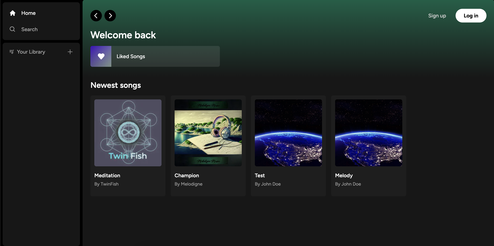
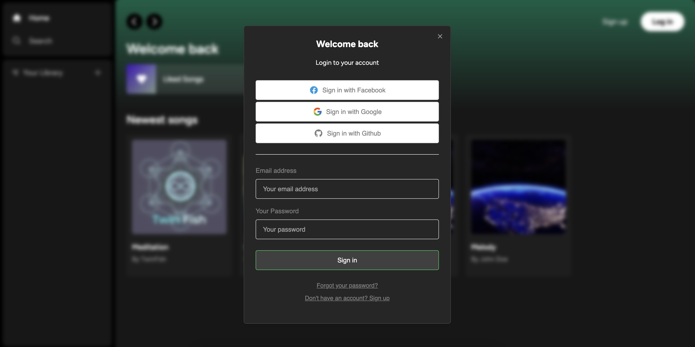

## About
This is a clone web app implementing the fundamental features of Spotify. This project was bootstrapped with Next.js and is hosted in Vercel.

**Demo**: [https://spotify-clone-kckusal.vercel.app](https://spotify-clone-kckusal.vercel.app)

**Screenshots**:





## Technologies used
**Frontend**: TailwindCSS, React, Typescript 

**Backend**: NextJS, Supabase, Stripe


## Features implemented
- User authentication (Sign up with email and providers like Facebook, Google, and GitHub.)
- Payment integration using Stripe.
- Subscription service.
- Upload, play, and mark songs as favorites.


## Running locally (development)
This is a [Next.js](https://nextjs.org/) project bootstrapped with [`create-next-app`](https://github.com/vercel/next.js/tree/canary/packages/create-next-app).

First, run the development server:

```bash
npm run dev
# or
yarn dev
# or
pnpm dev
```

Open [http://localhost:3000](http://localhost:3000) with your browser to see the result.

You can start editing the page by modifying `app/page.tsx`. The page auto-updates as you edit the file.

This project uses [`next/font`](https://nextjs.org/docs/basic-features/font-optimization) to automatically optimize and load Inter, a custom Google Font.
